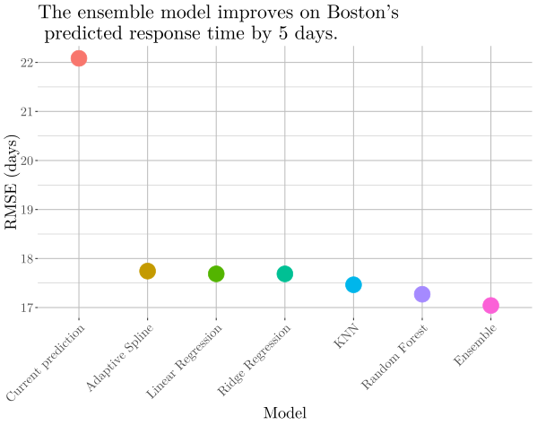

# Predicting response time for Boston 311 calls with machine learning.

## Summary

We examined 311 call reports from 2016–2019 to the city of Boston to create a prediction model for the time it takes to service 311 requests. Although the city currently provides a generic estimated time for a reported case to be closed, there is no way for individuals reporting issues to know exactly how long it will take for their request to be resolved. The goal of our model is to give greater transparency to citizens about when the request would be completed given a series of predictors such as location, request type, and month. On average, the stacked ensemble model (an adaptive spline trained on five base learners) provides a better estimate of completion time than the city does by 5 days. Due to computational limitations, this model trained with only *5 percent* of the total available 311 data. One that used all the data should deliver significantly improved performance.

See `final_report.pdf` for our complete project report.

Completed for API 222: Machine Learning and Big Data Analytics (Harvard Kennedy School, May 2019).

## The Data

Boston 311 data was obtained from [Analyze Boston](https://data.boston.gov/dataset/311-service-requests).

* `open_dt`: Date the issue was reported.
* `target_dt`: Date the city planned to handle the issue.
* `closed_dt`: Date the issue was closed.
* `reason`: General issue area.
* `type`: Specific issue. *N.B., this variable was excluded from the analysis because it has too many levels.*
* `department`: Whose responsibility the issue is.
* `fire_district`: Fire district the issue was reported in.
* `pwd_district`: Public Works district.
* `city_council_district`: City Council district.
* `police_district`: Police district.
* `neighborhood`: Neighborhood.
* `ward`: Ward.
* `location_zipcode`: ZIP code.
* `source`: Who reported the issue.
* `latitude`: Latitude.
* `longitude`: Longitude.
* `month_open`: Month the issue was reported.
* `completion_time`: Time it took to handle the issue.
* `completion_hours`: Hours it took to handle the issue.
* `promised_time`: Time the city planned to take to handle the issue.
* `promised_hours`: Hours the city planned to take to handle the issue.
* `time`: Categorical variable for morning, afternoon, or night reporting.
* `score`: Percentile score for the difference between how long the city thought it would take and how long it actually took (`promised` - `completion`). Higher is better, since it means it took shorter than expected.
